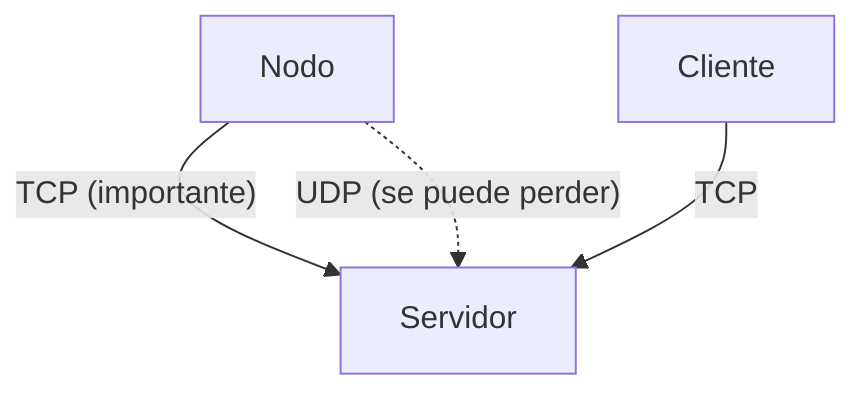
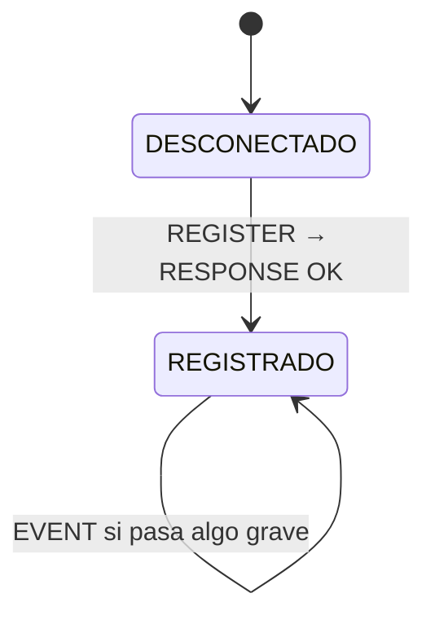
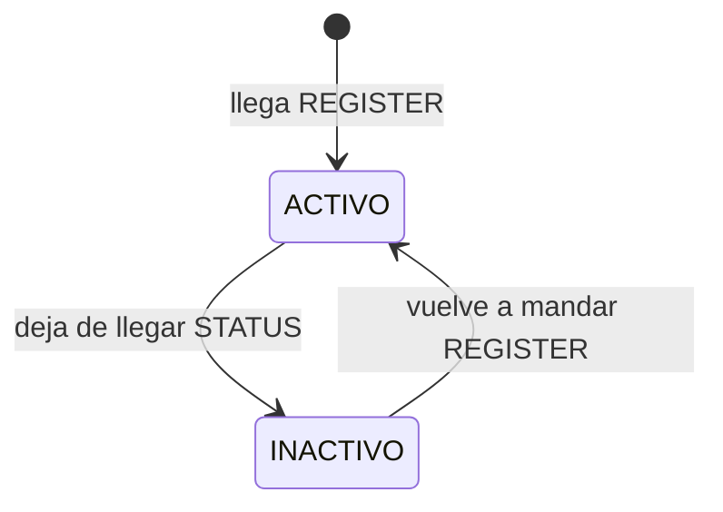

# Fase 1 — Diseño y Arquitectura
## Sistema de Monitoreo y Control Distribuido (Protocolo PMCD)

---

## De qué se trata esto

La idea es sencilla: tenemos un montón de nodos (sensores) regados por ahí, cada uno reportando
cómo está — su temperatura, su CPU, su batería — y necesitamos que un servidor central se entere
de todo eso y se lo pueda mostrar a quien lo consulte.

Lo normal es que no en todos los mensajes pesan lo mismo. Si un sensor manda su temperatura y ese
dato se pierde en el camino, no pasa nada grave, porque en un par de segundos llega el siguiente.
Pero si un sensor detecta que algo se está quemando y ese mensaje se pierde, ahí sí hay un
problema. Esa diferencia es la que termina definiendo casi todo el diseño del protocolo.

Los nodos nunca hablan directamente con los clientes que consultan la info — todo pasa siempre por
el servidor.

---

## La arquitectura



El servidor abre dos puertos: uno TCP para todo lo que no se puede perder, y uno UDP para la
telemetría normal. Cada conexión TCP que entra se atiende en su propio hilo, para que un cliente
lento no bloquee a los demás. Y en ningún lado del código va una IP escrita a mano — el nombre del
servidor se resuelve por DNS, y si esa resolución falla, se maneja la excepción y el programa sigue
corriendo.

---

## Las tres piezas

**Nodo**: se registra una vez, después manda su estado todo el tiempo, y si detecta algo raro,
avisa.

**Servidor**: recibe todo lo anterior, guarda el estado de cada nodo, atiende a los clientes que se
conectan a preguntar, y deja registro (log) de cada cosa que pasa, tanto en consola como en un
archivo.

**Cliente**: inicia sesión y puede consultar el estado actual o el historial de cualquier nodo.

---

## Por qué usamos TCP y UDP juntos

Nos pareció más honesto separar los mensajes según qué tan grave es que se pierdan, en vez de
meter todo por el mismo canal.

- Lo que **se puede perder** sin drama (el estado normal de un nodo) va por **UDP**. Es más liviano,
  no hay que mantener una conexión abierta, y como el dato se repite cada pocos segundos, si se
  pierde uno no importa.
- Lo que **no se puede perder** (registrar un nodo, avisar un evento crítico, el login de un
  cliente, una consulta) va por **TCP**, porque ahí sí necesitamos la garantía de que el mensaje
  llega, en orden, y con confirmación.

No armamos ningún sistema propio de confirmaciones sobre UDP — el enunciado ya dice que la pérdida
de telemetría es tolerable, así que hacerlo sería complicar algo que no hace falta complicar. Lo
único que sí hacemos es que, si un nodo deja de mandar su estado por un buen rato, el servidor
asume que se cayó y lo marca como inactivo.

---

## El protocolo que armamos

Decidimos no usar un encabezado binario con bytes y offsets porque para lo que necesitamos es
sobrecomplicarse sin ganar nada. En su lugar, cada mensaje es una sola línea de texto:

```
TIPO;campo=valor;campo=valor
```

Y ya. Se parte por `;` y por `=`, con `strtok` en C es trivial.

Todo el protocolo se resume en seis tipos de mensaje:

| Mensaje | Lo manda | Va por |
|---|---|---|
| `REGISTER` | el nodo | TCP |
| `STATUS` | el nodo | UDP |
| `EVENT` | el nodo | TCP |
| `LOGIN` | el cliente | TCP |
| `QUERY` | el cliente | TCP |
| `RESPONSE` | el servidor | TCP |

El servidor nunca inventa un tipo de respuesta distinto para cada cosa — siempre contesta con
`RESPONSE`, y adentro del mensaje va si fue `OK` o `ERROR` y los datos que correspondan.

Un par de ejemplos de cómo se ven en la práctica:

```
REGISTER;node_id=sensor01;tipo=iot

STATUS;node_id=sensor01;cpu=42.5;temp=36.2

EVENT;node_id=sensor01;tipo=ALARMA;valor=95.0

LOGIN;user=admin1;clave=1234

QUERY;node_id=sensor01;n=5

RESPONSE;status=OK;msg=registrado
RESPONSE;status=ERROR;msg=nodo_no_encontrado
```

---

## Cómo se mueve todo esto en el tiempo

Un nodo arranca desconectado, manda su `REGISTER`, y en cuanto le llega el `RESPONSE` pasa a estar
registrado. De ahí en adelante manda `STATUS` cada pocos segundos, y si en algún momento pasa algo
grave, manda un `EVENT` y espera su confirmación.



Del lado del servidor, cada nodo que conoce está activo mientras le sigan llegando datos, e
inactivo si deja de reportar por mucho tiempo.



El cliente es todavía más simple: se conecta, hace login, y desde ahí puede preguntar lo que
necesite. No hace falta ni dibujarlo, son dos estados.

---

## Cuando algo sale mal

No inventamos un mensaje de error distinto para cada caso — todo error es un `RESPONSE` con
`status=ERROR` y un mensaje que dice qué pasó. Los casos que ya tenemos contemplados:

- alguien pregunta por un nodo que no existe,
- un login con credenciales incorrectas,
- un cliente que intenta consultar sin haber iniciado sesión.

Y si el servidor no logra resolver un nombre de dominio, no se cae: registra el error en el log y
sigue funcionando normalmente.

---

## Lo que hay que tener fresco para la exposición

- Todo el diseño gira alrededor de una idea: lo que se puede perder va por UDP, lo que no, por TCP.
- El protocolo tiene seis mensajes, todos en texto plano, formato `TIPO;campo=valor`.
- El servidor siempre responde con lo mismo, `RESPONSE`, y ahí adentro va si salió bien o mal.
- El nodo tiene dos-tres estados, el servidor otros dos, nada complicado de dibujar en el tablero.
- La concurrencia se resuelve con un hilo por conexión TCP.
